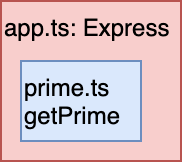
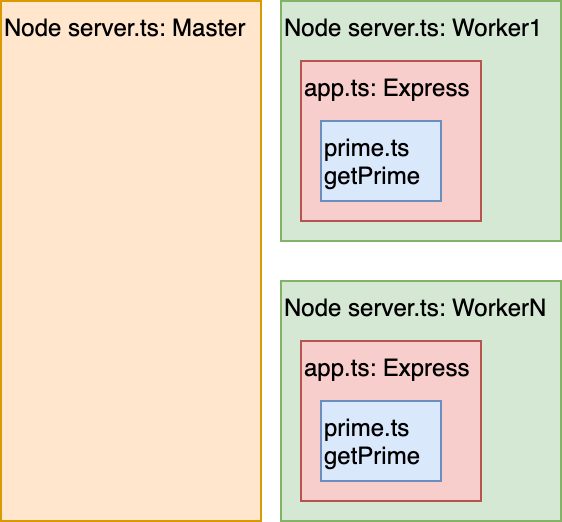
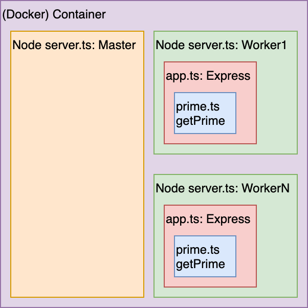
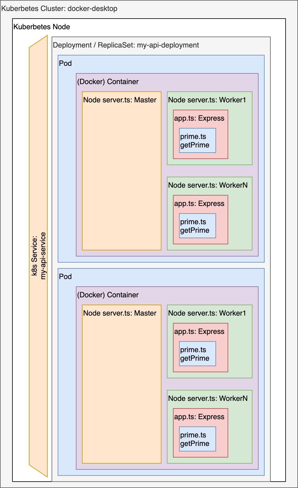
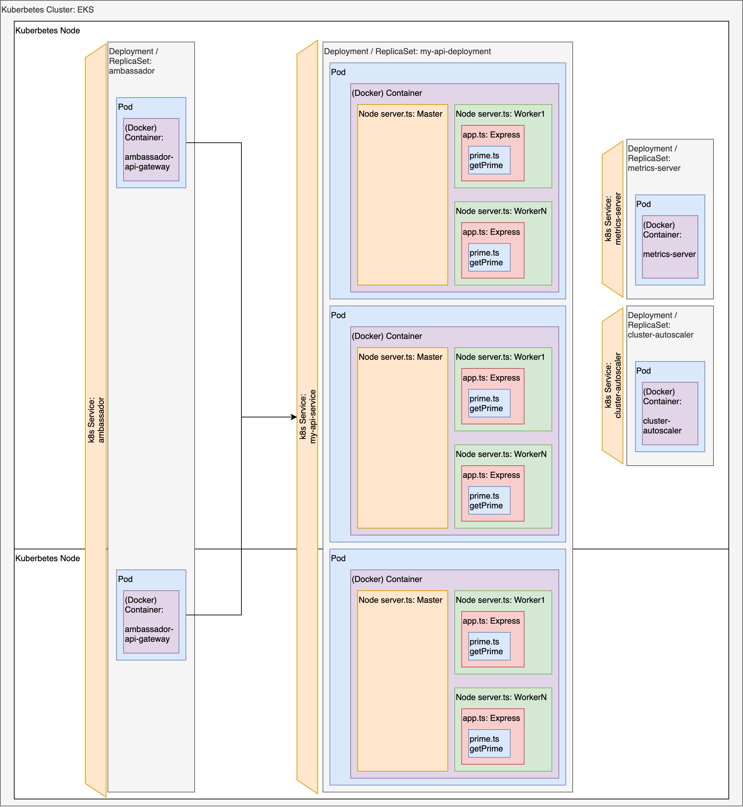

# Does it scale??? 

This project acts as a POC for a task I needed at work but also takes the idea of a course I took as CompSci Honours where they used a base64 encoder/decoder instead.

[Step 1](#nodejs-typescript-express):



 - DEV: Start with a simple function. We will calculate the Nth prime number.
 - DEV: Now wrap it in an API to make it accessible across a network as a server
 - TEST: Write some tests for it.

[Step 2](#nodejs-typescript-express):



 - DEV: The API should exploit all the CPU parallelism that it can with workers
 - TEST: Write tests for the API

[Step 3](#docker-container):



 - DEV: Package it up for Deployment via a container
 - TEST: Write integration tests to test the container

[Step 4](#local-kubernetes):



 - DEV: We want the container to be orchestrated with Kubernetes for better fault tolerance and sit behind an API gateway. 
 - TEST: Write integration tests to test our service through the API gateway that multiple instances load balance the work.

[Step 5](#deploy-to-aws-eks):



 - DEV: Deploy it to a cloud provider and configure autoscaling of resources
 - TEST: Test our service prvisions more resources under load and cleans up unused resources.


## Quickstart

```bash
brew install awscli aws-iam-authenticator eksctl telepresence
```

```bash
git clone https://github.com/neozenith/does-it-scale
cd does-it-scale
npm i
npm t
```

You will also need to create a `.env` file with the following content:

```
export ECR_HOST=<your ECR host here>
export ECR_REGION=us-west-2
export ECR=$ECR_HOST/<your_repository_name>
export DOCKER_BUILDKIT=1
```

To get this information you'll want to follow the [Creating an ECR Repository Userguide](https://docs.aws.amazon.com/AmazonECR/latest/userguide/repository-create.html).

---

## NodesJS-Typescript-Express


```bash
npm t
```

This unit tests the function as well as the Express HTTP server by using `supertest`.

---

## Docker Container


```bash
npm run dkr-start
npm run dkr-test
npm run dkr-stop
```

This builds our server as a docker image and starts it up on port 3000.

We then use `supertest` by passing a URL instead of an Express instance.

Finally we clean up by stopping the container.

---


## Local Kubernetes


```bash
npm run k8s-start
npm run k8s-test
npm run k8s-stop
```

It is at this point I highly recommend using [Lens](https://k8slens.dev/) as a desktop application to visualise what is happening in your local k8s context.

This will use `kubectl` to apply the definitions under `k8s/common`. This creates the API gateway and Ingress rules for Ambassador.
It will also apply `k8s/local/api.yml` which is a `docker-desktop` friendly definition of our service.

For testing to work we will use `telepresence`. Unlike Docker, a local kubernetes environment is not so simple to forward a port to our host machine.

Telepresence will create a docker container in your Docker VM, it will also create a matching Pod inside our Kubernetes context. These two are a VPN into our cluster.

The end result is we can reuse our API test suite from [Docker Container](#docker-container) and use k8s internal DNS to use the service name as the URL.

Finally we tear it all down in the correct order.

---

## Deploy to AWS EKS


### Push image to ECR

You will need a `.env` file as described in [Quickstart](#quickstart).

```bash
npm run ecr-login
npm run docker-build
npm run docker-push
```

Now our image is available on ECR for EKS to pull in as part of our build definition.

### Create empty cluster

```bash
# WARNING This step takes about 20 minutes.
npm run eks-start-cluster
# WARNING This step takes about 20 minutes.
```

This step uses `eks/cluster-managed.yml` definition of EKS resources for the `eksctl` CLI tool to setup our cluster.

### Update IAM Service Role

```bash
export EKS_IAM_ROLE=$(npm run --silent eks-iam-get-role)

aws iam put-role-policy \
  --role-name $EKS_IAM_ROLE \
  --policy-name eks-autoscaler \
  --policy-document file://iam/iam-cluster-autoscaler-servicerole-policy.json
```

### Apply Deployments

```bash
npm run eks-start-common
npm run eks-start-cloud
```

These will deploy our definitions.

### Run test suite

```bash
npm run eks-test
```

Finally.... this reuses our API test from [Docker Container](#docker-container) and we should see pod autoscaling and node auto scaling.

The `metrics-server` for pod autoscaling monitors metrics on a 5s interval but will invoke scaling actions every 30s if necessary but can take 1-5 minutes to scale down as it prefers to keep pods warm rather than aggresively scaling down.

The `cluster-auto-scaler` needs special privileges for it's service account to scan the EC2 resources and schedule node scaling. It can take 10 minutes to naturally cool off and scale down a node as it 
prefers to keep it warm long enough to receive subsequent spikes of resource use.

Recap: quick scale up, slow to scale down to keep resources warm jsut in case.


### Delete Deployments

```bash
npm run eks-stop-cloud
npm run eks-stop-common
aws iam delete-role-policy \
  --role-name $EKS_IAM_ROLE \
  --policy-name eks-autoscaler
```

Tear down our definitions.

### Delete Cluster

```bash
# This can take 10 minutes to tear down.
npm run eks-stop-cluster
```

Clean up insfrastructure resources.

---

## Troubleshooting

### Manunally adding cluster to kubeconfig
```
aws sts get-caller-identity

{
    "UserId": "AKIA999999999999999",
    "Account": "111111111111",
    "Arn": "arn:aws:iam::111111111111:user/my_service_account_user
}

aws eks list-clusters --region us-west-2
{
    "clusters": [
        "mycluster"
    "
}

aws eks --region us-west-2 update-kubeconfig --name mycluster
```

# Resources:
 - https://www.amazon.com.au/Kubernetes-Running-Dive-Future-Infrastructure-ebook/dp/B07YP1XSZ9
 - https://kubernetes.io/docs/tasks/run-application/horizontal-pod-autoscale/
 - https://docs.aws.amazon.com/eks/latest/userguide/cluster-autoscaler.html
 - https://www.amazon.com.au/Distributed-Systems-Node-js-Building-Enterprise-Ready-ebook/dp/B08MTJ4H6L/
 - https://k8slens.dev/
 - https://eksctl.io/